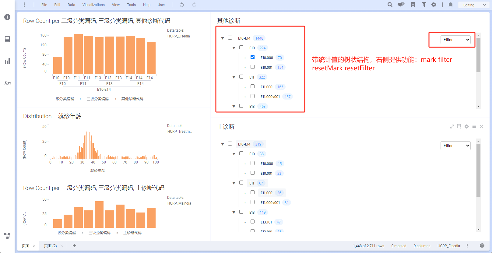
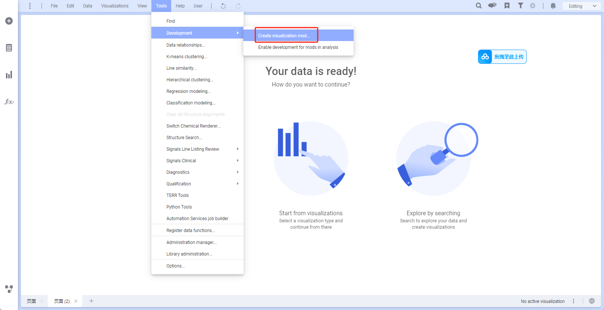
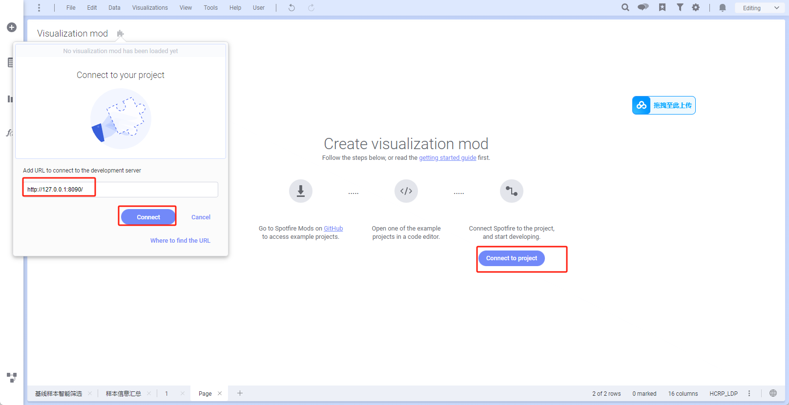

# My Visualization Mod

## 简介
这是一个spotfire mods插件，用于将spotfire的数据转为带统计结果的树状结构

<br>
</img>

### 功能简介
能通过指定他绑定的table，使用spotfire自己的统计功能，附带到树状结构上，且统计值动态变化
提供 功能 mark filter clearMark resetFilter

mark:在此mods组件中勾选复选框，对应的table会有mark效果出现
filter:在此mods组件中勾选复选框，对应的table会有filter效果出现，连同其关联表也会出现filter联动过滤效果
clearMark:重置当前mark效果
resetFilter:重置当前filter效果
我提供了一个demo附件，文件位置
resource/demo.dxp

## 快速部署
### 启动服务
```sh
git clone https://github.com/xiaoping1993/spotfire-mods-table_to_checktree.git
npm install # 安装依赖
npm run build # 编译
npm run server #本地启动，到这里会默认启动http://127.0.0.1:8090/mod-manifest.json
```
### 在spotfire中配置此插件所需额外配置
添加文档属性：modFilters
添加ironPython脚本：filterAction
```python
from Spotfire.Dxp.Application.Filters import *
from Spotfire.Dxp.Application.Visuals import VisualContent
from System import Guid
import json

page = Application.Document.ActivePageReference
filterPanel = page.FilterPanel
for fs in Document.FilteringSchemes:
    if fs.FilteringSelectionReference.Name == "Filtering scheme": 
        filterPanel.FilteringSchemeReference = fs
#定义参数变量
modFilter = Document.Properties["modFilters"]
modFilter = modFilter.strip("'")
modFilterJson = json.loads(modFilter)
tableName = modFilterJson["tableName"]
columnName = modFilterJson["columnName"]
filterType = modFilterJson["filterType"]
filterValue = modFilterJson["filterValue"]
print filterValue
dataTable = Document.Data.Tables[tableName]
filterReference = Document.FilteringSchemes.DefaultFilteringSchemeReference[dataTable][columnName]
if filterType=="ListBoxFilter":    
	lbFilter = filterReference.As[ListBoxFilter]()
	_array = filterValue
	lbFilter.IncludeAllValues=False
	lbFilter.SetSelection(_array)
if filterType=='resetFilter':
	 Document.FilteringSchemes.DefaultFilteringSchemeReference[dataTable].ResetAllFilters()    
```

### 在spotfire中安装插件

<br>


